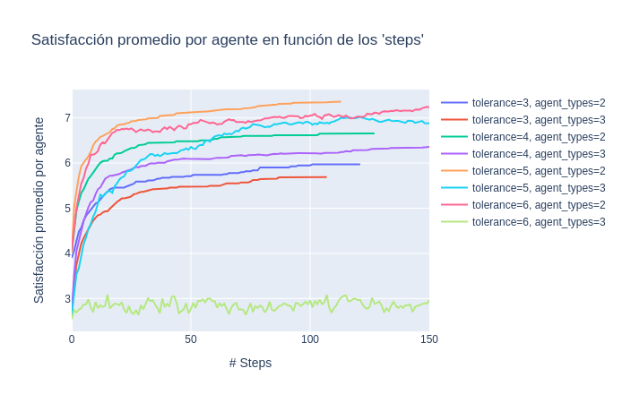
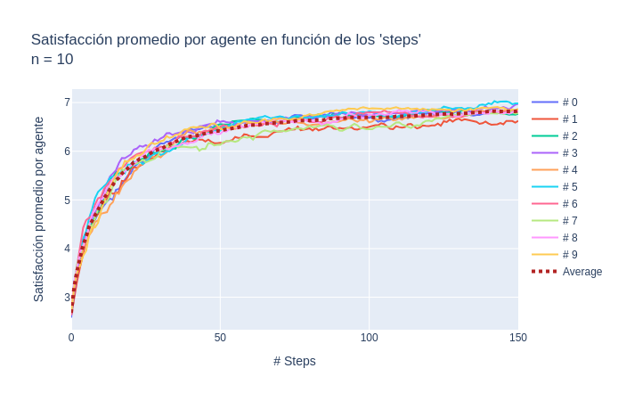
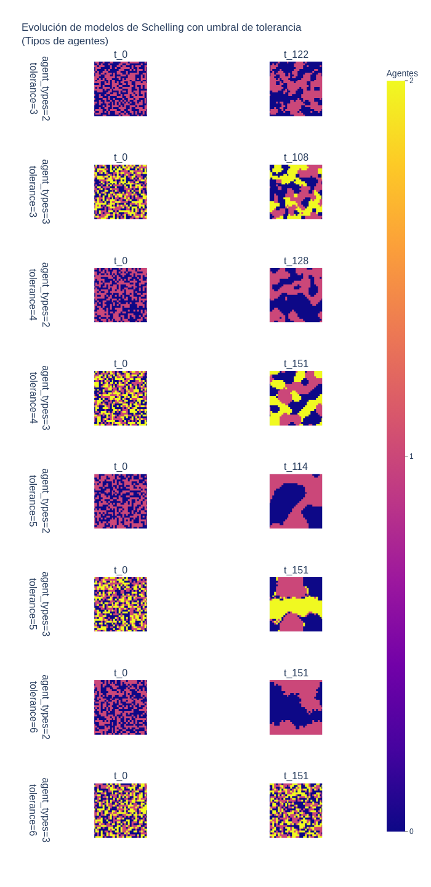
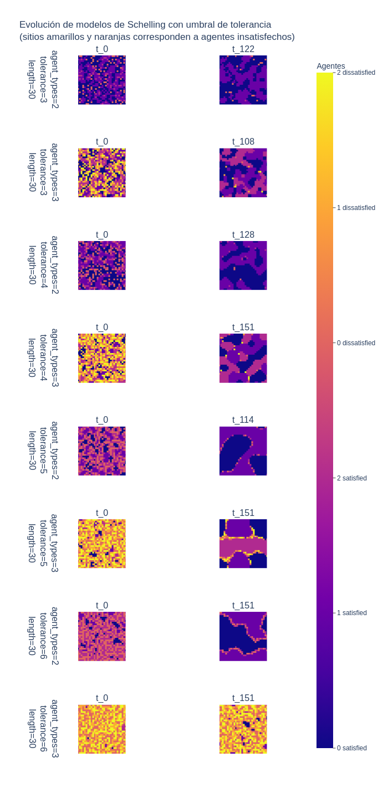
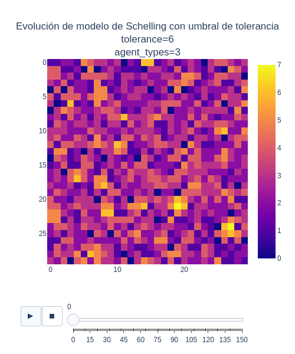

# Modelado y Simulación de Sistemas Complejos con Aplicaciones en Economía

> [!NOTE]
> ### 1° Cuatrimestre 2024 - Optativa

Re-Implementaciones de los modelos de simulación vistos en la materia.

## Jupyter Notebooks

El repositorio posee un conjunto de [*notebooks*](notebooks/) donde fui realizando diversos analisis de los modelos.

## Modelos

### Grilla abstracta

```python
from src.models.abstract.model import AbstractLatticeModel
```

Incluye todo el comportamiento básico de un modelo computable del tipo autómata celular sobre de 2 dimensiones.

Espera parámetros clásicos como:
* `length`: un entero $n$ que define el tamaño final de la grilla $n \times n$.
* `configuration`: una configuración inicial de la grilla. De no proveer ninguna, se genera una automáticamente.
* `neighborhood`: la estrategia que define dada una posición, cuales celdas serán sus vecinas. Hay implementadas dos posibles:
    * `src.simulation.core.neighborhood.VonNeumann` (default)
    * `src.simulation.core.neighborhood.Moore`
* `agent_types`: la cantidad de tipos de agentes disponibles en la grilla. Valor por default: 2.
* `update_simultaneously`: valor *booleano* que permite indicar al modelo si la actualización de cada agente debe impactar en la configuración global, permitiendo que impacte en las actualizaciones siguientes (`False`, valor por defecto), o si en un mismo paso de simulación se actualizan todos los agentes en una grilla temporal y al finalizar dicho proceso, se impactan todos los cambios temporales en la grilla global, logrando así que cada agente se base en el estado previo (`True`).

### Agente abstracto

```python
from src.models.abstract.agent import Agent
```

Si bien al modelo abstracto se le pueden ingresar configuraciones iniciales (un *array* de $x \in [0..$`agent_types`$)$ de $n \times n$), la grilla sobre la que trabaja el modelo no termina siendo una matriz de enteros, sino que es una de *agentes*, por lo que pueden tener un comportamiento mas complejo de ser necesario.

El modelo abstracto provee un agente abstracto básico, que contiene un único atributo `agent_type`. Por lo tanto, si en la configuración ingresada $M_{T_0}$, tenemos que $M_{T_0}[i,j] = x$, con $x \in [0..$`agent_types`$)$, en la configuración inicial $M_{T_1}$ realmente tendremos que $M_{T_1}[i,j] = $`Agent(agent_type=x)`$.

Luego, si el modelo $Y$ necesita un comportamiento más complejo de parte los agentes (ver el caso del modelo de mercado inmobiliario), se puede crear $W$, que subclasifica la clase `Agent` y especializarlo para el caso. Cuando se inicializa el modelo abstracto, el mismo hace uso del método `_create_agent`, por lo que se puede reimplementar éste método en $Y$ para hacer uso del nuevo modelo de agente:

```python
from src.models.abstract.agent import Agent
from src.models.abstract.model import AbstractLatticeModel

class W(Agent):
    pass

class Y(AbstractLatticeModel):
    ...
    def _create_agent(self, basic_agent: Agent, i: int, j: int) -> W:
        ...
        return W(agent_type=basic_agent.agent_type)
    ...
```

### Evolución del modelo

Como se mencionó, toda la lógica básica del autómata está contenida en el modelo abstracto. El único método que obligatoriamente debe definir un modelo concreto es el `step`. En el mismo se debe indicar como se actualizará el modelo, agente a agente. Luego, según el valor de `update_simultaneously`, esa actualización impactará en la configuración global o una temporal.

```python
def step(self, i: int, j: int, **kwargs) -> None:
    pass
```

### Series

La evolución del modelo irá generando múltiples datos de interés, iteración a iteración. Se pueden implementar diferentes métodos en el modelo concreto y decorarlos con `@as_series`. Esto hará que luego de cada iteración global, el resultado de dicho método se almacene, generando una serie de datos para poder analizar al finalizar la simulación. El resultado puede ser cualquier objeto, ya sea valores enteros, decimales o hasta snapshots de la grilla.

De hecho, una serie que puede ser de interés trivial, es la grilla y sus valores de `agent_type` para cada celda, en un tiempo dado. El siguiente método `agent_types_lattice`, nos asegurará tener esa información al finalizar la simulación:

```python
from src.models.abstract.model import AbstractLatticeModel, as_series

class Y(AbstractLatticeModel):
    ...
    @as_series
    def agent_types_lattice(self) -> List[List[int]]:
        action = lambda i, j: self.get_agent(i, j).agent_type
        return self._process_lattice_with(action)
```

La serie se guardará en un atributo `series: dict`, de la instancia del modelo simulado. La *key* de la serie es el nombre del método relacionado con la misma. Es decir si la configuración inicial es $M_{T_0}$, para la serie del caso anterior vale:

`Y().series["agent_types_lattice"][0] = ` $M_{T_0}$

En algunos casos puede ser útil relacionar los datos obtenidos en una serie con cierta *metadata* a visualizar en los *plotters*. Esto se puede lograr usando el decorador `as_series_with`.

> [!IMPORTANT]
> Ésto puede tener un costo computacional importante, en espacio y tiempo. No es la intención del presente código lograr optimizar este procedimiento, por lo tanto se debe utilizar con criterio.

### Modelos Computacionales

#### Schelling

```python
from src.models.computational.schelling.model import Schelling
```

Parámetros:
* `tolerance: int`

#### Mercado Inmobiliario

```python
from src.models.computational.real_state_market.model import RealStateMarket
```

Parámetros:
* `alpha: float = 0.5`
* `A: float = 1 / 16`
* `B: float = 0.5`
* `utility_tolerance: float = 0.85`

#### Condensación

```python
from src.models.computational.condensation.model import Condensation
```

Parámetros:
* `probability: float`

#### Juego de la vida (Conway)

```python
from src.models.computational.game_of_life.model import GameOfLife
from src.models.computational.game_of_life.seeds import Seed
```

Parámetros:
* `seeds: List[Seed]`

## Parámetros

Como hemos visto los modelos poseen múltiples parámetros, propios o heredados del modelo abstracto, los cuales sería interesante analizar con un set de valores posibles y sus diferentes combinaciones.

Para lograr esto, está la clase `ExperimentParametersSet`. Esta clase permite recolectar los diferentes valores a analizar para cada uno de los atributos de interés. Se le puede pasar cualquier atributo de formato `keyword`, por lo tanto hay que ver que parámetros espera el modelo que utilizaremos y utilizar los mismos nombres.

Por ejemplo, sabemos que el modelo abstracto acepta `length` y `neighborhood`, y si estamos usando en concreto el modelo de `GameOfLife`, además podemos pasarle una lista de *semillas* o *patrones*, por lo que un posible conjunto de parámetros a simular sería el siguiente:

```python
from src.simulation.core.experiment import ExperimentParametersSet
from src.simulation.core.neighborhood import Moore

seeds = [Blinker(25,25), Blinker(28,28), Glider(10,10)]
experiment_parameters_set = ExperimentParametersSet(
    length=[50, 60, 70],
    neighborhood=[Moore],
    seeds=[seeds],
)
```

Internamente, se aplicará el producto cartesiano a las diferentes listas de parámetros, generando un conjunto de parámetros donde cada elemento será una configuración de parámetros para una instancia dada. Como en el ejemplo tenemos 3 parámetros donde uno tiene 3 valores posibles y los 2 restantes tienen un único valor posible, el cardinal del conjunto resultante será $3 \times 1 \times 1 = 3$. Algo como lo siguiente:

```json
[
    {
        'length': 50,
        'neighborhood': Moore,
        'seeds': seeds,
    },
    {
        'length': 60,
        'neighborhood': Moore,
        'seeds': seeds,
    },
    {
        'length': 70,
        'neighborhood': Moore,
        'seeds': seeds,
    },
]
```

Notar que en los valores posibles de parámetros, en principio se pueden ingresar cualquier cantidad. Es decir, se puede hacer un barrido en múltiples parámetros en simultáneo. La complejidad del analisis final dependerá de la selección de éstos valores, pero el sistema en principio no impone ningún límite al respecto. En el siguiente ejemplo tenemos una cardinalidad de $3 \times 2 \times 3 = 18$:

```python
from src.simulation.core.experiment import ExperimentParametersSet
from src.simulation.core.neighborhood import Moore, VonNeumann

seeds=[
    [Block(1,1), BeeHive(1,44), Loaf(23,23), Boat(44,1), Tub(44,44)],
    [Blinker(2,2), Toad(2,44), Beacon(44,2), Pulsar(19,19), Pentadecathlon(35,35)],
    [Glider(25, 25), LightWeightSpaceship(2,2), MiddleWeightSpaceship(1,20), HeavyWeightSpaceship(1,40)],
]
experiment_parameters_set = ExperimentParametersSet(
    length=[50, 60, 70],
    neighborhood=[Moore, VonNeumann],
    seeds=seeds,
)
```

> [!IMPORTANT]
> Como todos los atributos de la clase `ExperimentParametersSet` deben ser listas, si un parámetro particular ya es del tipo `List` (como es el caso de `seeds`), notar que se debe pasar una lista de listas.

## Runner

Para simular un modelo existe el objeto `Runner`, que conoce el protocolo del modelo abstracto para poder ejecutarlo sin que nos preocupemos por su implementación. Por lo tanto, con el `experiment_parameters_set` anterior, podríamos realizar algo como lo siguiente:

```python
from src.simulation.core.runner import Runner
from src.simulation.core.equilibrium_criterion import WithoutCriterion
from src.models.computational.game_of_life.model import GameOfLife

runner = Runner(
    model=GameOfLife,
    experiment_parameters_set=experiment_parameters_set,
    equilibrium_criterion=WithoutCriterion(),
    max_steps=50,
)

runner.start()
```

En el presente ejemplo no hay criterio de equilibrio, por lo que la simulación indefectiblemente se ejecutará hasta la iteración máxima indicada. Pero se pueden implementar distintos criterios de equilibrio y utilizarlos en las instancias de `Runner`. Para ello existe la clase `AbstractCriterion` que define una interfaz que todos los criterios deberían implementar:

```python
class AbstractCriterion(ABC):
    @abstractmethod
    def in_equilibrium(self, series: Dict[str, Any]) -> bool:
        pass
```

En particular, ya se provee un criterio mas interesante (además del visto anteriormente, `WithoutCriterion`).

```python
from src.simulation.core.equilibrium_criterion import EquilibriumCriterion

criterion = EquilibriumCriterion(
    series_name="total_average_satisfaction_level",
    window_size=20,
    tolerance=0.001,
)
```

Dicho criterio (utilizado por ejemplo en conjunto con el modelo de Schelling) permitirá a la instancia de `Runner` poder ir observando la evolución de la serie llamada `total_average_satisfaction_level`, tomar una ventana temporal pasada de 20 iteraciones y decidir si durante dicha ventana, el total de los valores de la serie se mantuvieron dentro de la tolerancia. De ser así, el método `in_equilibrium` del presente criterio devolverá `True` y le permitirá saber al *runner* que debe interrumpir la simulación aunque no haya llegado a la iteración máxima.

La clase `Runner` tiene un último atributo interesante que nos permite repetir el experimento múltiples veces, para encontrar tendencias, sacar promedios, etc. Éste es el parámetro `repeat`, que recibe una instancia de la clase `Execute`.

> [!WARNING]
> Por simpleza se decide que dicha *feature* sólo funcione en conjunto con instancias de `ExperimentParametersSet` que generen conjuntos de cardinalidad 1, es decir, con una única instancia de experimentación. Mas adelante y de ser útil, ésto podría realizarse para cualquier instancia de `ExperimentParametersSet` posible.

Por ejemplo, en el caso de un modelo de Schelling podría ser interesante realizar 10 simulaciones con los mismos parámetros, obtener las 10 series que informan la evolución del promedio de satisfacción en cada experimento y sacar el promedio de ellas. Para ello podríamos hacer algo como:

```python
from src.simulation.core.runner import Runner, Execute

runner = Runner(
    Schelling,
    experiment_parameters_set,
    criterion,
    max_steps=150,
    repeat=Execute("total_average_satisfaction_level", times=10),
)
```

De ser necesario guardar el historial de más de una serie a traves de las múltiples repeticiones del experimento, se pueden pasar varios nombres de series a la clase `Execute`, todos como parámetros en formato posicional, antes del parámetro *keyword* `times` (cuyo valor por defecto es 1).

## Plotters

Finalmente, existen 3 objetos que grafican los resultados. Todos entienden el método de clase `show_up`.

> [!IMPORTANT]
> Los *plotters* utilizan Plotly para mostrar los distintos resultados.

### Series numéricas

Para graficar series temporales con valores numéricos se puede utilizar la clase `NumericalSeries`. Los parámetros principales son el nombre de la serie a graficar, la instancia del *runner* que contiene los datos, el título del gráfico, tamaño del mismo, los titulos de los ejes y si deben ser mostrados de forma logarítmica. Por ejemplo, nuevamente con el caso de Schelling:

```python
from src.simulation.plotters.numerical_series import NumericalSeries

NumericalSeries.show_up(
    "total_average_satisfaction_level",
    runner=runner,
    plot_title="Satisfacción promedio por agente en función de los 'steps'",
    yaxis_title="Satisfacción promedio por agente",
)
```



El *plotter* generará automáticamente las leyendas para cada serie en base a los parámetros usados. Dado que lo mas natural sería no hacer barridos de demasiados parámetros a la vez, ya que se complejizaría mucho el analisis final, las leyendas automáticas no deberían generar nombres demasiado largos y complejos.

Algo interesante a mencionar es que si la instancia de *runner* provista tenía un *repeat* mayor a 1 (por lo tanto se trata de un conjunto de varios experimentos pero no con diferentes conjuntos de parámetros, sino con el mismo), el *plotter* automáticamente considerará que las series solicitadas son comparables y calculará el promedio entre ellas, sin que se tenga que pasar parámetro alguno.



> [!NOTE]
> Quizás mas adelante se puedan agregar otras funcionalidades interesantes más allá que solo calcular el promedio.

### Grilla final

Si se quiere observar una serie bidimensional sobre un conjunto de simulaciones con distintas combinaciones de parámetros, el *plotter* a utilizar es `FinalGridSeries`. Sus parámetros son el nombre de la serie a graficar, la instancia de *runner* con los resultados simulados, el título del grafico, la leyenda, tamaño del diagrama, etc.

```python
from src.simulation.plotters.final_grid import FinalGridSeries

FinalGridSeries.show_up(
    "agent_types_lattice",
    runner=runner,
    plot_title=("Evolución de modelos de Schelling con umbral de tolerancia <br>"
                "(Tipos de agentes)"),
    leyend="Agentes",
)
```



El presente *plotter* tiene otro atributo llamado `attributes_to_consider`. Esto es porque como se ha mencionado, los *plotters* automáticamente generan un identificador a cada experimento en base a la combinación de sus parámetros. Pero los parámetros utilizados para estos identificadores son solamente los que varían.

Si un parámetro fue igual para todos los experimentos, no aparecerá en el identificador del experimento y por lo tanto, tampoco aparecerá en las leyendas del gráfico resultante. Dicho atributo nos permite entonces agregar otros parámetros que querramos mostrar en las leyendas, más allá de haber sido parte del barrido de parámetros o no. Si en éste atributo se indica un parámetro que ya es considerado por el *plotter* por defecto, se lo considera una única vez (por ejemplo el atributo `tolerance` en el *snippet* siguiente, ya se contemplaba porque el runner posee experimentos que varían dicho atributo):

```python
from src.simulation.plotters.final_grid import FinalGridSeries

FinalGridSeries.show_up(
    "dissatisfaction_threshold_lattice",
    runner=runner,
    plot_title=("Evolución de modelos de Schelling con umbral de tolerancia <br>"
                "(sitios amarillos y naranjas corresponden a agentes insatisfechos)"),
    leyend="Agentes",
    attributes_to_consider=["length", "tolerance"],
)
```



> [!TIP]
> A modo aclaratorio: cada fila del diagrama es un experimento simulado por el *runner*. Se muestran la configuración inicial y la final. A la izquierda de cada fila se visualiza el identificador mencionado, correspondiente a los parámetros utilizados en cada experimento. Arriba de cada configuración se indica la iteración a la que corresponde, en formato t_i.

### Grilla Animada

Si se quiere observar la evolución paso a paso (y no solo la configuración inicial y final), se debe utilizar `AnimatedLatticeSeries`, cuyos atributos son el nombre de la serie, la instancia de *runner*, el número de experimento a graficar (en base 0), el título del gráfico, las dimensiones, la velocidad de reproducción (valor entre 0 y 1) y nuevamente, el mencionado `attributes_to_consider` con la misma lógica.

```python
from src.simulation.plotters.animated_lattice import AnimatedLatticeSeries

AnimatedLatticeSeries.show_up(
    "satisfaction_level_lattice",
    runner=runner,
    experiment_id=7,
    plot_title="Evolución de modelo de Schelling con umbral de tolerancia",
    height=600,
    width=500
)
```


